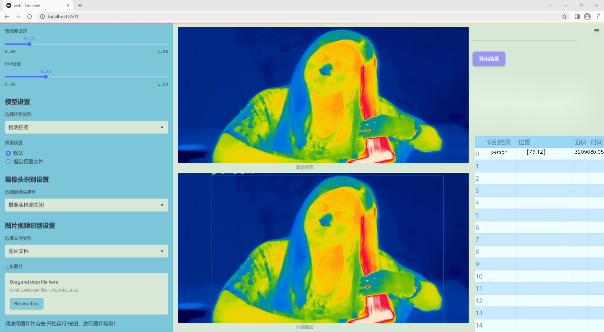
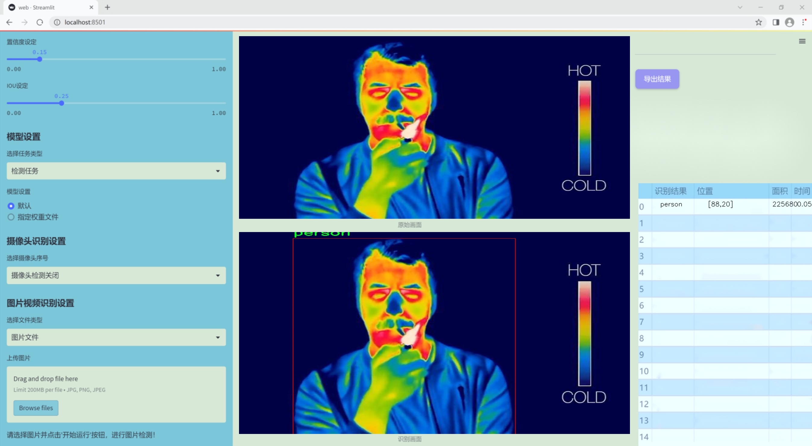
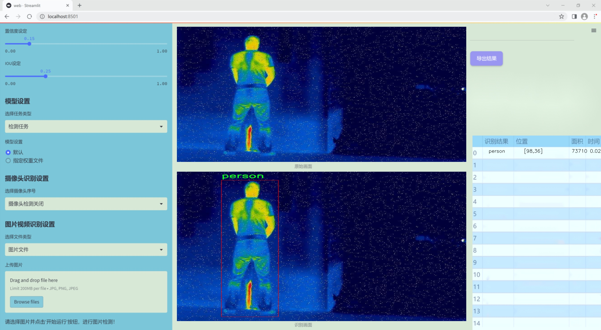
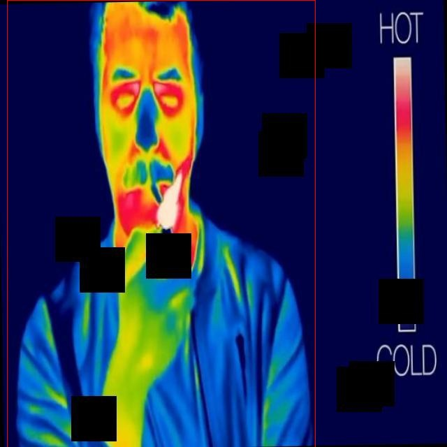
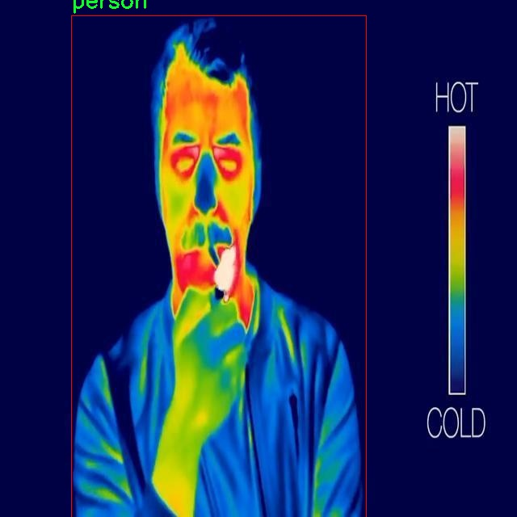
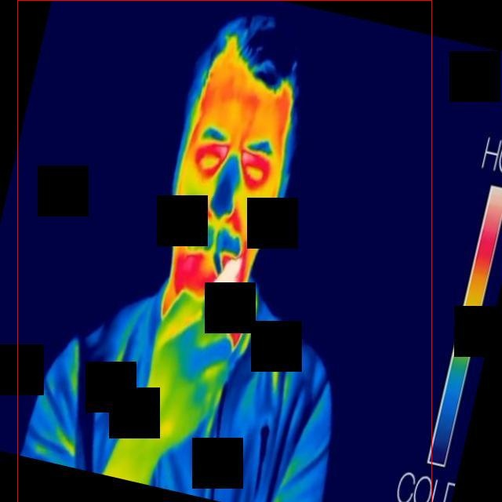

### 1.背景意义

研究背景与意义

随着城市化进程的加快，行人检测技术在智能交通、公共安全和人机交互等领域的应用日益广泛。传统的行人检测方法在复杂环境下的表现往往受到限制，尤其是在低光照或恶劣天气条件下。红外光谱技术因其在夜间和低能见度条件下的优越性能，逐渐成为行人检测研究的热点。红外图像能够有效捕捉到人类体温所发出的热辐射，进而在各种环境中实现对行人的精准识别。

本研究旨在基于改进的YOLOv11模型，构建一个高效的红外光谱行人检测系统。YOLO（You Only Look Once）系列模型以其实时性和高准确率而受到广泛关注，然而，现有的YOLO模型在处理红外图像时，仍存在对特征提取和目标定位能力不足的问题。因此，通过对YOLOv11进行改进，结合红外图像的特性，可以提升行人检测的准确性和鲁棒性。

本项目所使用的数据集包含2185幅经过标注的红外图像，专注于行人这一单一类别。数据集的构建经过严格的预处理，包括自动方向调整和统一尺寸调整，以确保模型训练的有效性。尽管未应用图像增强技术，但数据集的丰富性和多样性为模型的训练提供了良好的基础。

通过本研究的实施，期望能够为行人检测技术的发展提供新的思路和方法，推动智能监控和安全系统的进步。此外，改进的YOLOv11模型在红外图像处理中的应用，将为相关领域的研究者提供有价值的参考，促进计算机视觉技术在实际应用中的进一步发展。

### 2.视频效果

[2.1 视频效果](https://www.bilibili.com/video/BV1spBeY6ELr/)

### 3.图片效果







##### [项目涉及的源码数据来源链接](https://kdocs.cn/l/cszuIiCKVNis)**

注意：本项目提供训练的数据集和训练教程,由于版本持续更新,暂不提供权重文件（best.pt）,请按照6.训练教程进行训练后实现上图演示的效果。

### 4.数据集信息

##### 4.1 本项目数据集类别数＆类别名

nc: 1
names: ['person']


该项目为【目标检测】数据集，请在【训练教程和Web端加载模型教程（第三步）】这一步的时候按照【目标检测】部分的教程来训练

##### 4.2 本项目数据集信息介绍

本项目数据集信息介绍

本项目所使用的数据集专注于“heat_detection”主题，旨在为改进YOLOv11的红外光谱行人检测系统提供高质量的训练数据。该数据集的设计初衷是通过捕捉红外光谱下的人体热辐射特征，提升行人检测的准确性和鲁棒性。数据集中包含的类别数量为1，具体类别为“person”，这意味着数据集专注于行人的检测，简化了模型的训练过程，使其能够更专注于识别这一特定目标。

在数据集的构建过程中，采集了多种环境下的红外图像，包括白天和夜晚、不同天气条件以及各种背景复杂度。这种多样性确保了模型在实际应用中的适应性，能够有效应对不同场景下的行人检测需求。此外，数据集中还包含了不同距离和角度下的行人图像，进一步增强了模型的泛化能力。

为了确保数据集的高质量，所有图像均经过严格的标注和审核，确保每个样本的准确性。标注过程中，采用了先进的图像处理技术，确保行人在红外图像中的热特征能够被清晰识别。这种细致的标注工作为后续的模型训练提供了坚实的基础，使得YOLOv11能够在行人检测任务中发挥出色的性能。

综上所述，本项目的数据集不仅在数量上具备了足够的样本支持，而且在质量和多样性上也进行了精心设计，旨在推动红外光谱行人检测技术的发展，为实际应用提供更为可靠的解决方案。通过这一数据集的训练，期望能够显著提升YOLOv11在复杂环境下的行人检测能力，为智能监控、公共安全等领域的应用提供有力支持。









### 5.全套项目环境部署视频教程（零基础手把手教学）

[5.1 所需软件PyCharm和Anaconda安装教程（第一步）](https://www.bilibili.com/video/BV1BoC1YCEKi/?spm_id_from=333.999.0.0&vd_source=bc9aec86d164b67a7004b996143742dc)


[5.2 安装Python虚拟环境创建和依赖库安装视频教程（第二步）](https://www.bilibili.com/video/BV1ZoC1YCEBw?spm_id_from=333.788.videopod.sections&vd_source=bc9aec86d164b67a7004b996143742dc)

### 6.改进YOLOv11训练教程和Web_UI前端加载模型教程（零基础手把手教学）

[6.1 改进YOLOv11训练教程和Web_UI前端加载模型教程（第三步）](https://www.bilibili.com/video/BV1BoC1YCEhR?spm_id_from=333.788.videopod.sections&vd_source=bc9aec86d164b67a7004b996143742dc)


按照上面的训练视频教程链接加载项目提供的数据集，运行train.py即可开始训练



     Epoch   gpu_mem       box       obj       cls    labels  img_size
     1/200     20.8G   0.01576   0.01955  0.007536        22      1280: 100%|██████████| 849/849 [14:42<00:00,  1.04s/it]
               Class     Images     Labels          P          R     mAP@.5 mAP@.5:.95: 100%|██████████| 213/213 [01:14<00:00,  2.87it/s]
                 all       3395      17314      0.994      0.957      0.0957      0.0843

     Epoch   gpu_mem       box       obj       cls    labels  img_size
     2/200     20.8G   0.01578   0.01923  0.007006        22      1280: 100%|██████████| 849/849 [14:44<00:00,  1.04s/it]
               Class     Images     Labels          P          R     mAP@.5 mAP@.5:.95: 100%|██████████| 213/213 [01:12<00:00,  2.95it/s]
                 all       3395      17314      0.996      0.956      0.0957      0.0845

     Epoch   gpu_mem       box       obj       cls    labels  img_size
     3/200     20.8G   0.01561    0.0191  0.006895        27      1280: 100%|██████████| 849/849 [10:56<00:00,  1.29it/s]
               Class     Images     Labels          P          R     mAP@.5 mAP@.5:.95: 100%|███████   | 187/213 [00:52<00:00,  4.04it/s]
                 all       3395      17314      0.996      0.957      0.0957      0.0845


###### [项目数据集下载链接](https://kdocs.cn/l/cszuIiCKVNis)

### 7.原始YOLOv11算法讲解

YOLOv11是Ultralytics推出的YOLO系列最新版本，专为实现尖端的物体检测而设计。其架构和训练方法上进行了重大改进，使之不仅具备卓越的准确性和处理速度，还在计算效率上实现了一场革命。得益于其改进的主干和颈部架构，YOLOv11在特征提取和处理复杂任务时表现更加出色。在2024年9月27日，Ultralytics通过长达九小时的在线直播发布这一新作，展示了其在计算机视觉领域的革新。

YOLOv11通过精细的架构设计和优化训练流程，在保持高精度的同时，缩减了参数量，与YOLOv8m相比减少了22%的参数，使其在COCO数据集上的平均准确度（mAP）有所提升。这种效率的提高使YOLOv11非常适合部署在各种硬件环境中，包括边缘设备、云计算平台以及支持NVIDIA GPU的系统，确保在灵活性上的优势。

该模型支持广泛的任务，从对象检测、实例分割到图像分类、姿态估计和定向对象检测（OBB），几乎覆盖了计算机视觉的所有主要挑战。其创新的C3k2和C2PSA模块提升了网络深度和注意力机制的应用，提高了特征提取的效率和效果。同时，YOLOv11的改进网络结构也使之在复杂视觉任务上得以从容应对，成为各类计算机视觉任务的多功能选择。这些特性令YOLOv11在实施实时物体检测的各个领域中表现出众。
* * *

2024年9月27日，Ultralytics在线直播长达九小时，为YOLO11召开“发布会”

YOLO11 是 Ultralytics YOLO 系列实时物体检测器的最新版本，它以尖端的准确性、速度和效率重新定义了可能性。在之前 YOLO
版本的显著进步的基础上，YOLO11 在架构和训练方法方面进行了重大改进，使其成为各种计算机视觉任务的多功能选择。


##### YOLO11主要特点：

  * 增强的特征提取：YOLO11 采用了改进的主干和颈部架构，增强了特征提取能力，可实现更精确的对象检测和复杂任务性能。
  * 针对效率和速度进行了优化：YOLO11 引入了完善的架构设计和优化的训练流程，可提供更快的处理速度，并在准确度和性能之间保持最佳平衡。
  * 更少的参数，更高的准确度：借助模型设计的进步，YOLO11m 在 COCO 数据集上实现了更高的平均准确度 (mAP)，同时使用的参数比 YOLOv8m 少 22%，从而提高了计算效率，同时又不影响准确度。
  * 跨环境的适应性：YOLO11 可以无缝部署在各种环境中，包括边缘设备、云平台和支持 NVIDIA GPU 的系统，从而确保最大的灵活性。
  * 支持的任务范围广泛：无论是对象检测、实例分割、图像分类、姿势估计还是定向对象检测 (OBB)，YOLO11 都旨在满足各种计算机视觉挑战。

##### 支持的任务和模式

YOLO11 以 YOLOv8 中引入的多功能模型系列为基础，为各种计算机视觉任务提供增强的支持：

Model| Filenames| Task| Inference| Validation| Training| Export  
---|---|---|---|---|---|---  
YOLO11| yolol11n.pt, yolol11s.pt, yolol11m.pt, yolol11x.pt| Detection| ✅| ✅|
✅| ✅  
YOLO11-seg| yolol11n-seg.pt, yolol11s-seg.pt, yolol11m-seg.pt,
yolol11x-seg.pt| Instance Segmentation| ✅| ✅| ✅| ✅  
YOLO11-pose| yolol11n-pose.pt, yolol11s-pose.pt, yolol11m-pose.pt,
yolol11x-pose.pt| Pose/Keypoints| ✅| ✅| ✅| ✅  
YOLO11-obb| yolol11n-obb.pt, yolol11s-obb.pt, yolol11m-obb.pt,
yolol11x-obb.pt| Oriented Detection| ✅| ✅| ✅| ✅  
YOLO11-cls| yolol11n-cls.pt, yolol11s-cls.pt, yolol11m-cls.pt,
yolol11x-cls.pt| Classification| ✅| ✅| ✅| ✅  
  
##### 简单的 YOLO11 训练和推理示例

以下示例适用于用于对象检测的 YOLO11 Detect 模型。

    
    
    from ultralytics import YOLO
    
    # Load a model
    model = YOLO("yolo11n.pt")
    
    # Train the model
    train_results = model.train(
        data="coco8.yaml",  # path to dataset YAML
        epochs=100,  # number of training epochs
        imgsz=640,  # training image size
        device="cpu",  # device to run on, i.e. device=0 or device=0,1,2,3 or device=cpu
    )
    
    # Evaluate model performance on the validation set
    metrics = model.val()
    
    # Perform object detection on an image
    results = model("path/to/image.jpg")
    results[0].show()
    
    # Export the model to ONNX format
    path = model.export(format="onnx")  # return path to exported model

##### 支持部署于边缘设备

YOLO11 专为适应各种环境而设计，包括边缘设备。其优化的架构和高效的处理能力使其适合部署在边缘设备、云平台和支持 NVIDIA GPU
的系统上。这种灵活性确保 YOLO11 可用于各种应用，从移动设备上的实时检测到云环境中的复杂分割任务。有关部署选项的更多详细信息，请参阅导出文档。

##### YOLOv11 yaml文件

    
    
    # Ultralytics YOLO 🚀, AGPL-3.0 license
    # YOLO11 object detection model with P3-P5 outputs. For Usage examples see https://docs.ultralytics.com/tasks/detect
    
    # Parameters
    nc: 80 # number of classes
    scales: # model compound scaling constants, i.e. 'model=yolo11n.yaml' will call yolo11.yaml with scale 'n'
      # [depth, width, max_channels]
      n: [0.50, 0.25, 1024] # summary: 319 layers, 2624080 parameters, 2624064 gradients, 6.6 GFLOPs
      s: [0.50, 0.50, 1024] # summary: 319 layers, 9458752 parameters, 9458736 gradients, 21.7 GFLOPs
      m: [0.50, 1.00, 512] # summary: 409 layers, 20114688 parameters, 20114672 gradients, 68.5 GFLOPs
      l: [1.00, 1.00, 512] # summary: 631 layers, 25372160 parameters, 25372144 gradients, 87.6 GFLOPs
      x: [1.00, 1.50, 512] # summary: 631 layers, 56966176 parameters, 56966160 gradients, 196.0 GFLOPs
    
    # YOLO11n backbone
    backbone:
      # [from, repeats, module, args]
      - [-1, 1, Conv, [64, 3, 2]] # 0-P1/2
      - [-1, 1, Conv, [128, 3, 2]] # 1-P2/4
      - [-1, 2, C3k2, [256, False, 0.25]]
      - [-1, 1, Conv, [256, 3, 2]] # 3-P3/8
      - [-1, 2, C3k2, [512, False, 0.25]]
      - [-1, 1, Conv, [512, 3, 2]] # 5-P4/16
      - [-1, 2, C3k2, [512, True]]
      - [-1, 1, Conv, [1024, 3, 2]] # 7-P5/32
      - [-1, 2, C3k2, [1024, True]]
      - [-1, 1, SPPF, [1024, 5]] # 9
      - [-1, 2, C2PSA, [1024]] # 10
    
    # YOLO11n head
    head:
      - [-1, 1, nn.Upsample, [None, 2, "nearest"]]
      - [[-1, 6], 1, Concat, [1]] # cat backbone P4
      - [-1, 2, C3k2, [512, False]] # 13
    
      - [-1, 1, nn.Upsample, [None, 2, "nearest"]]
      - [[-1, 4], 1, Concat, [1]] # cat backbone P3
      - [-1, 2, C3k2, [256, False]] # 16 (P3/8-small)
    
      - [-1, 1, Conv, [256, 3, 2]]
      - [[-1, 13], 1, Concat, [1]] # cat head P4
      - [-1, 2, C3k2, [512, False]] # 19 (P4/16-medium)
    
      - [-1, 1, Conv, [512, 3, 2]]
      - [[-1, 10], 1, Concat, [1]] # cat head P5
      - [-1, 2, C3k2, [1024, True]] # 22 (P5/32-large)
    
      - [[16, 19, 22], 1, Detect, [nc]] # Detect(P3, P4, P5)
    

**YOLO11和YOLOv8 yaml文件的区别**


##### 改进模块代码

  * C3k2 

    
    
    class C3k2(C2f):
        """Faster Implementation of CSP Bottleneck with 2 convolutions."""
    
        def __init__(self, c1, c2, n=1, c3k=False, e=0.5, g=1, shortcut=True):
            """Initializes the C3k2 module, a faster CSP Bottleneck with 2 convolutions and optional C3k blocks."""
            super().__init__(c1, c2, n, shortcut, g, e)
            self.m = nn.ModuleList(
                C3k(self.c, self.c, 2, shortcut, g) if c3k else Bottleneck(self.c, self.c, shortcut, g) for _ in range(n)
            )

C3k2，它是具有两个卷积的CSP（Partial Cross Stage）瓶颈架构的更快实现。

**类继承：**

  * `C3k2`继承自类`C2f`。这表明`C2f`很可能实现了经过修改的基本CSP结构，而`C3k2`进一步优化或修改了此结构。

**构造函数（`__init__`）：**

  * `c1`：输入通道。

  * `c2`：输出通道。

  * `n`：瓶颈层数（默认为1）。

  * `c3k`：一个布尔标志，确定是否使用`C3k`块或常规`Bottleneck`块。

  * `e`：扩展比率，控制隐藏层的宽度（默认为0.5）。

  * `g`：分组卷积的组归一化参数或组数（默认值为 1）。

  * `shortcut`：一个布尔值，用于确定是否在网络中包含快捷方式连接（默认值为 `True`）。

**初始化：**

  * `super().__init__(c1, c2, n, short-cut, g, e)` 调用父类 `C2f` 的构造函数，初始化标准 CSP 组件，如通道数、快捷方式、组等。

**模块列表（`self.m`）：**

  * `nn.ModuleList` 存储 `C3k` 或 `Bottleneck` 模块，具体取决于 `c3k` 的值。

  * 如果 `c3k` 为 `True`，它会初始化 `C3k` 模块。`C3k` 模块接收以下参数：

  * `self.c`：通道数（源自 `C2f`）。

  * `2`：这表示在 `C3k` 块内使用了两个卷积层。

  * `shortcut` 和 `g`：从 `C3k2` 构造函数传递。

  * 如果 `c3k` 为 `False`，则初始化标准 `Bottleneck` 模块。

`for _ in range(n)` 表示将创建 `n` 个这样的块。

**总结：**

  * `C3k2` 实现了 CSP 瓶颈架构，可以选择使用自定义 `C3k` 块（具有两个卷积）或标准 `Bottleneck` 块，具体取决于 `c3k` 标志。

  * C2PSA

    
    
    class C2PSA(nn.Module):
        """
        C2PSA module with attention mechanism for enhanced feature extraction and processing.
    
        This module implements a convolutional block with attention mechanisms to enhance feature extraction and processing
        capabilities. It includes a series of PSABlock modules for self-attention and feed-forward operations.
    
        Attributes:
            c (int): Number of hidden channels.
            cv1 (Conv): 1x1 convolution layer to reduce the number of input channels to 2*c.
            cv2 (Conv): 1x1 convolution layer to reduce the number of output channels to c.
            m (nn.Sequential): Sequential container of PSABlock modules for attention and feed-forward operations.
    
        Methods:
            forward: Performs a forward pass through the C2PSA module, applying attention and feed-forward operations.
    
        Notes:
            This module essentially is the same as PSA module, but refactored to allow stacking more PSABlock modules.
    
        Examples:
            >>> c2psa = C2PSA(c1=256, c2=256, n=3, e=0.5)
            >>> input_tensor = torch.randn(1, 256, 64, 64)
            >>> output_tensor = c2psa(input_tensor)
        """
    
        def __init__(self, c1, c2, n=1, e=0.5):
            """Initializes the C2PSA module with specified input/output channels, number of layers, and expansion ratio."""
            super().__init__()
            assert c1 == c2
            self.c = int(c1 * e)
            self.cv1 = Conv(c1, 2 * self.c, 1, 1)
            self.cv2 = Conv(2 * self.c, c1, 1)
    
            self.m = nn.Sequential(*(PSABlock(self.c, attn_ratio=0.5, num_heads=self.c // 64) for _ in range(n)))
    
        def forward(self, x):
            """Processes the input tensor 'x' through a series of PSA blocks and returns the transformed tensor."""
            a, b = self.cv1(x).split((self.c, self.c), dim=1)
            b = self.m(b)
            return self.cv2(torch.cat((a, b), 1))

`C2PSA` 模块是一个自定义神经网络层，带有注意力机制，用于增强特征提取和处理。

**类概述**

  * **目的：**

  * `C2PSA` 模块引入了一个卷积块，利用注意力机制来改进特征提取和处理。

  * 它使用一系列 `PSABlock` 模块，这些模块可能代表某种形式的位置自注意力 (PSA)，并且该架构旨在允许堆叠多个 `PSABlock` 层。

**构造函数（`__init__`）：**

  * **参数：**

  * `c1`：输入通道（必须等于 `c2`）。

  * `c2`：输出通道（必须等于 `c1`）。

  * `n`：要堆叠的 `PSABlock` 模块数量（默认值为 1）。

  * `e`：扩展比率，用于计算隐藏通道的数量（默认值为 0.5）。

  * **属性：**

  * `self.c`：隐藏通道数，计算为 `int(c1 * e)`。

  * `self.cv1`：一个 `1x1` 卷积，将输入通道数从 `c1` 减少到 `2 * self.c`。这为将输入分成两部分做好准备。

  * `self.cv2`：另一个 `1x1` 卷积，处理后将通道维度恢复回 `c1`。

  * `self.m`：一系列 `PSABlock` 模块。每个 `PSABlock` 接收 `self.c` 通道，注意头的数量为 `self.c // 64`。每个块应用注意和前馈操作。

**前向方法：**

  * **输入：**

  * `x`，输入张量。

  * **操作：**

  1. `self.cv1(x)` 应用 `1x1` 卷积，将输入通道大小从 `c1` 减小到 `2 * self.c`。

  2. 生成的张量沿通道维度分为两部分，`a` 和 `b`。

  * `a`：第一个 `self.c` 通道。

  * `b`：剩余的 `self.c` 通道。

  1. `b` 通过顺序容器 `self.m`，它是 `PSABlock` 模块的堆栈。这部分经过基于注意的处理。

  2. 处理后的张量 `b` 与 `a` 连接。

  3. `self.cv2` 应用 `1x1` 卷积，将通道大小恢复为 `c1`。

  * **输出：**

  * 应用注意和卷积操作后的变换后的张量。

**总结：**

  * **C2PSA** 是一个增强型卷积模块，它通过堆叠的 `PSABlock` 模块应用位置自注意力。它拆分输入张量，将注意力应用于其中一部分，然后重新组合并通过最终卷积对其进行处理。此结构有助于从输入数据中提取复杂特征。

##### 网络结构


### 8.200+种全套改进YOLOV11创新点原理讲解

#### 8.1 200+种全套改进YOLOV11创新点原理讲解大全

由于篇幅限制，每个创新点的具体原理讲解就不全部展开，具体见下列网址中的改进模块对应项目的技术原理博客网址【Blog】（创新点均为模块化搭建，原理适配YOLOv5~YOLOv11等各种版本）

[改进模块技术原理博客【Blog】网址链接](https://gitee.com/qunmasj/good)


#### 8.2 精选部分改进YOLOV11创新点原理讲解

###### 这里节选部分改进创新点展开原理讲解(完整的改进原理见上图和[改进模块技术原理博客链接](https://gitee.com/qunmasj/good)【如果此小节的图加载失败可以通过CSDN或者Github搜索该博客的标题访问原始博客，原始博客图片显示正常】


### LSKNet的架构
该博客提出的结构层级依次为：

LSK module（大核卷积序列+空间选择机制） < LSK Block （LK Selection + FFN）<LSKNet（N个LSK Block）


#### LSK 模块

LSK Block
LSKNet 是主干网络中的一个可重复堆叠的块（Block），每个LSK Block包括两个残差子块，即大核选择子块（Large Kernel Selection，LK Selection）和前馈网络子块（Feed-forward Network ，FFN），如图8。LK Selection子块根据需要动态地调整网络的感受野，FFN子块用于通道混合和特征细化，由一个全连接层、一个深度卷积、一个 GELU 激活和第二个全连接层组成。

LSK module（LSK 模块，图4）由一个大核卷积序列（large kernel convolutions）和一个空间核选择机制（spatial kernel selection mechanism）组成，被嵌入到了LSK Block 的 LK Selection子块中。

#### Large Kernel Convolutions
因为不同类型的目标对背景信息的需求不同，这就需要模型能够自适应选择不同大小的背景范围。因此，作者通过解耦出一系列具有大卷积核、且不断扩张的Depth-wise 卷积，构建了一个更大感受野的网络。

具体地，假设序列中第i个Depth-wise 卷积核的大小为 ，扩张率为 d，感受野为 ，它们满足以下关系：


卷积核大小和扩张率的增加保证了感受野能够快速增大。此外，我们设置了扩张率的上限，以保证扩张卷积不会引入特征图之间的差距。


Table2的卷积核大小可根据公式（1）和（2）计算，详见下图：


这样设计的好处有两点。首先，能够产生具有多种不同大小感受野的特征，便于后续的核选择；第二，序列解耦比简单的使用一个大型卷积核效果更好。如上图表2所示，解耦操作相对于标准的大型卷积核，有效地将低了模型的参数量。

为了从输入数据  的不同区域获取丰富的背景信息特征，可采用一系列解耦的、不用感受野的Depth-wise 卷积核：


其中，是卷积核为 、扩张率为  的Depth-wise 卷积操作。假设有个解耦的卷积核，每个卷积操作后又要经过一个的卷积层进行空间特征向量的通道融合。


之后，针对不同的目标，可基于获取的多尺度特征，通过下文中的选择机制动态选择合适的卷积核大小。

这一段的意思可以简单理解为：

把一个大的卷积核拆成了几个小的卷积核，比如一个大小为5，扩张率为1的卷积核加上一个大小为7，扩张率为3的卷积核，感受野为23，与一个大小为23，扩张率为1的卷积核的感受野是一样的。因此可用两个小的卷积核替代一个大的卷积核，同理一个大小为29的卷积核也可以用三个小的卷积代替（Table 2），这样可以有效的减少参数，且更灵活。

将输入数据依次通过这些小的卷积核（公式3），并在每个小的卷积核后面接上一个1×1的卷积进行通道融合（公式4）。

#### Spatial Kernel Selection
为了使模型更关注目标在空间上的重点背景信息，作者使用空间选择机制从不同尺度的大卷积核中对特征图进行空间选择。

首先，将来自于不同感受野卷积核的特征进行concate拼接，然后，应用通道级的平均池化和最大池化提取空间关系，其中， 和  是平均池化和最大池化后的空间特征描述符。为了实现不同空间描述符的信息交互，作者利用卷积层将空间池化特征进行拼接，将2个通道的池化特征转换为N个空间注意力特征图，之后，将Sigmoid激活函数应用到每一个空间注意力特征图，可获得每个解耦的大卷积核所对应的独立的空间选择掩膜，又然后，将解耦后的大卷积核序列的特征与对应的空间选择掩膜进行加权处理，并通过卷积层进行融合获得注意力特征 ，最后LSK module的输出可通过输入特征  与注意力特征  的逐元素点成获得，公式对应于结构图上的操作如下：


### 9.系统功能展示

图9.1.系统支持检测结果表格显示

  图9.2.系统支持置信度和IOU阈值手动调节

  图9.3.系统支持自定义加载权重文件best.pt(需要你通过步骤5中训练获得)

  图9.4.系统支持摄像头实时识别

  图9.5.系统支持图片识别

  图9.6.系统支持视频识别

  图9.7.系统支持识别结果文件自动保存

  图9.8.系统支持Excel导出检测结果数据


### 10. YOLOv11核心改进源码讲解

#### 10.1 mamba_yolo.py

以下是经过精简和注释的核心代码部分：

```python
import torch
import torch.nn as nn
from einops import rearrange
from functools import partial

# 定义一个2D层归一化类
class LayerNorm2d(nn.Module):
    def __init__(self, normalized_shape, eps=1e-6, elementwise_affine=True):
        super().__init__()
        self.norm = nn.LayerNorm(normalized_shape, eps, elementwise_affine)

    def forward(self, x):
        # 将输入张量从 (B, C, H, W) 转换为 (B, H, W, C)
        x = rearrange(x, 'b c h w -> b h w c').contiguous()
        x = self.norm(x)  # 应用层归一化
        # 将张量转换回 (B, C, H, W)
        x = rearrange(x, 'b h w c -> b c h w').contiguous()
        return x

# 自适应填充函数
def autopad(k, p=None, d=1):
    """根据卷积核大小和膨胀因子自动计算填充大小"""
    if d > 1:
        k = d * (k - 1) + 1 if isinstance(k, int) else [d * (x - 1) + 1 for x in k]  # 实际卷积核大小
    if p is None:
        p = k // 2 if isinstance(k, int) else [x // 2 for x in k]  # 自动填充
    return p

# 交叉选择扫描的前向传播
class CrossScan(torch.autograd.Function):
    @staticmethod
    def forward(ctx, x: torch.Tensor):
        B, C, H, W = x.shape
        ctx.shape = (B, C, H, W)
        xs = x.new_empty((B, 4, C, H * W))  # 创建新的张量用于存储结果
        xs[:, 0] = x.flatten(2, 3)  # 将输入展平
        xs[:, 1] = x.transpose(dim0=2, dim1=3).flatten(2, 3)  # 转置并展平
        xs[:, 2:4] = torch.flip(xs[:, 0:2], dims=[-1])  # 翻转
        return xs

# 选择性扫描核心
class SelectiveScanCore(torch.autograd.Function):
    @staticmethod
    @torch.cuda.amp.custom_fwd
    def forward(ctx, u, delta, A, B, C, D=None, delta_bias=None, delta_softplus=False, nrows=1, backnrows=1):
        # 确保输入张量是连续的
        if u.stride(-1) != 1:
            u = u.contiguous()
        if delta.stride(-1) != 1:
            delta = delta.contiguous()
        if D is not None and D.stride(-1) != 1:
            D = D.contiguous()
        if B.stride(-1) != 1:
            B = B.contiguous()
        if C.stride(-1) != 1:
            C = C.contiguous()
        
        # 处理输入并调用CUDA核心实现
        out, x, *rest = selective_scan_cuda_core.fwd(u, delta, A, B, C, D, delta_bias, delta_softplus, 1)
        ctx.save_for_backward(u, delta, A, B, C, D, delta_bias, x)  # 保存用于反向传播的张量
        return out

    @staticmethod
    @torch.cuda.amp.custom_bwd
    def backward(ctx, dout):
        u, delta, A, B, C, D, delta_bias, x = ctx.saved_tensors
        du, ddelta, dA, dB, dC, dD, ddelta_bias, *rest = selective_scan_cuda_core.bwd(
            u, delta, A, B, C, D, delta_bias, dout, x, ctx.delta_softplus, 1
        )
        return (du, ddelta, dA, dB, dC, dD, ddelta_bias, None, None, None, None)

# 定义一个简单的卷积层
class SimpleStem(nn.Module):
    def __init__(self, inp, embed_dim, ks=3):
        super().__init__()
        self.hidden_dims = embed_dim // 2
        self.conv = nn.Sequential(
            nn.Conv2d(inp, self.hidden_dims, kernel_size=ks, stride=2, padding=autopad(ks, d=1), bias=False),
            nn.BatchNorm2d(self.hidden_dims),
            nn.GELU(),
            nn.Conv2d(self.hidden_dims, embed_dim, kernel_size=ks, stride=2, padding=autopad(ks, d=1), bias=False),
            nn.BatchNorm2d(embed_dim),
            nn.SiLU(),
        )

    def forward(self, x):
        return self.conv(x)

# 定义一个视觉线索合并模块
class VisionClueMerge(nn.Module):
    def __init__(self, dim, out_dim):
        super().__init__()
        self.hidden = int(dim * 4)
        self.pw_linear = nn.Sequential(
            nn.Conv2d(self.hidden, out_dim, kernel_size=1, stride=1, padding=0),
            nn.BatchNorm2d(out_dim),
            nn.SiLU()
        )

    def forward(self, x):
        # 将输入张量进行下采样并合并
        y = torch.cat([
            x[..., ::2, ::2],
            x[..., 1::2, ::2],
            x[..., ::2, 1::2],
            x[..., 1::2, 1::2]
        ], dim=1)
        return self.pw_linear(y)
```

### 代码说明：
1. **LayerNorm2d**: 这是一个用于2D张量的层归一化模块，适用于图像数据。
2. **autopad**: 计算卷积操作的自动填充大小，以保持输出形状与输入形状相同。
3. **CrossScan**: 实现了一个交叉扫描操作，用于处理输入张量并生成不同视角的特征。
4. **SelectiveScanCore**: 实现了选择性扫描的核心逻辑，包含前向和反向传播的方法。
5. **SimpleStem**: 一个简单的卷积神经网络模块，用于图像特征提取。
6. **VisionClueMerge**: 用于合并不同的视觉线索，通过下采样和卷积操作生成最终输出。

这些核心部分为构建更复杂的神经网络模块提供了基础。

这个文件 `mamba_yolo.py` 是一个用于实现 YOLO（You Only Look Once）目标检测模型的 PyTorch 模块，包含了一些自定义的神经网络层和功能。以下是对文件中各个部分的详细说明。

首先，文件导入了一些必要的库，包括 PyTorch、数学库、以及一些用于张量操作的库。它还尝试导入一些 CUDA 相关的模块，以便在 GPU 上加速计算。

接下来，定义了一个 `LayerNorm2d` 类，它是一个自定义的二维层归一化模块。该模块在前向传播中会调整输入张量的维度，以适应 `nn.LayerNorm` 的要求。

`autopad` 函数用于自动计算卷积操作的填充，以确保输出的形状与输入相同。它根据卷积核的大小和膨胀因子来决定填充的大小。

接着，定义了 `CrossScan` 和 `CrossMerge` 类，这两个类实现了自定义的前向和反向传播操作，主要用于处理张量的交叉扫描和合并操作。这些操作对于处理图像数据时的特征提取和融合非常重要。

`SelectiveScanCore` 类是一个自定义的选择性扫描操作的实现，它使用了 CUDA 加速。这个类的前向和反向传播方法实现了选择性扫描的核心逻辑，能够有效地处理输入张量并计算梯度。

`cross_selective_scan` 函数是一个高层次的接口，用于执行选择性扫描操作。它接受多个输入参数，包括权重和偏置，并返回经过处理的输出张量。

`SS2D` 类是一个包含多个参数的模块，设计用于处理输入特征并生成输出特征。它包含多个卷积层、线性层和激活函数，能够实现复杂的特征变换。

`RGBlock` 和 `LSBlock` 类分别实现了残差块和层归一化块，这些块在深度学习模型中常用于构建更深的网络结构。

`XSSBlock` 和 `VSSBlock_YOLO` 类是 YOLO 模型的核心模块，分别实现了交叉选择性扫描和 YOLO 特定的特征提取功能。这些模块结合了前面定义的各种层和操作，以实现高效的目标检测。

`SimpleStem` 类是模型的初始部分，负责将输入图像通过一系列卷积层进行特征提取。它将输入的通道数减少，并应用激活函数。

最后，`VisionClueMerge` 类用于合并不同来源的特征，以便在模型的后续处理中使用。它通过卷积层和批归一化层对合并后的特征进行处理。

总体而言，这个文件实现了一个复杂的神经网络结构，结合了多种深度学习技术，以支持高效的目标检测任务。每个模块都经过精心设计，以确保在处理图像数据时能够充分利用 GPU 加速和高效的特征提取。

#### 10.2 SMPConv.py

以下是代码中最核心的部分，并附上详细的中文注释：

```python
import torch
import torch.nn as nn
import torch.nn.functional as F

# 定义一个函数用于生成相对位置的坐标
def rel_pos(kernel_size):
    # 生成从-1到1的线性空间，步数为kernel_size
    tensors = [torch.linspace(-1, 1, steps=kernel_size) for _ in range(2)]
    # 使用meshgrid生成网格坐标
    kernel_coord = torch.stack(torch.meshgrid(*tensors), dim=-0)
    kernel_coord = kernel_coord.unsqueeze(0)  # 增加一个维度
    return kernel_coord

# 定义一个自定义卷积层SMPConv
class SMPConv(nn.Module):
    def __init__(self, planes, kernel_size, n_points, stride, padding, groups):
        super().__init__()

        self.planes = planes  # 输出通道数
        self.kernel_size = kernel_size  # 卷积核大小
        self.n_points = n_points  # 关键点数量
        self.init_radius = 2 * (2/kernel_size)  # 初始化半径

        # 生成卷积核坐标
        kernel_coord = rel_pos(kernel_size)
        self.register_buffer('kernel_coord', kernel_coord)  # 注册为缓冲区，不会被优化

        # 权重坐标初始化
        weight_coord = torch.empty(1, n_points, 2)
        nn.init.trunc_normal_(weight_coord, std=0.2, a=-1., b=1.)  # 截断正态分布初始化
        self.weight_coord = nn.Parameter(weight_coord)  # 权重坐标作为可学习参数

        # 半径参数初始化
        self.radius = nn.Parameter(torch.empty(1, n_points).unsqueeze(-1).unsqueeze(-1))
        self.radius.data.fill_(value=self.init_radius)  # 填充初始半径

        # 权重初始化
        weights = torch.empty(1, planes, n_points)
        nn.init.trunc_normal_(weights, std=.02)  # 权重初始化
        self.weights = nn.Parameter(weights)  # 权重作为可学习参数

    def forward(self, x):
        # 生成卷积核并增加维度
        kernels = self.make_kernels().unsqueeze(1)
        x = x.contiguous()  # 确保输入张量是连续的
        kernels = kernels.contiguous()  # 确保卷积核张量是连续的

        # 根据输入数据类型选择相应的深度可分离卷积实现
        if x.dtype == torch.float32:
            x = _DepthWiseConv2dImplicitGEMMFP32.apply(x, kernels)
        elif x.dtype == torch.float16:
            x = _DepthWiseConv2dImplicitGEMMFP16.apply(x, kernels)
        else:
            raise TypeError("Only support fp32 and fp16, get {}".format(x.dtype))
        return x        

    def make_kernels(self):
        # 计算权重坐标与卷积核坐标的差值
        diff = self.weight_coord.unsqueeze(-2) - self.kernel_coord.reshape(1, 2, -1).transpose(1, 2)  # [1, n_points, kernel_size^2, 2]
        diff = diff.transpose(2, 3).reshape(1, self.n_points, 2, self.kernel_size, self.kernel_size)
        # 计算差值的ReLU
        diff = F.relu(1 - torch.sum(torch.abs(diff), dim=2) / self.radius)  # [1, n_points, kernel_size, kernel_size]

        # 计算卷积核
        kernels = torch.matmul(self.weights, diff.reshape(1, self.n_points, -1))  # [1, planes, kernel_size*kernel_size]
        kernels = kernels.reshape(1, self.planes, *self.kernel_coord.shape[2:])  # [1, planes, kernel_size, kernel_size]
        kernels = kernels.squeeze(0)  # 去掉多余的维度
        kernels = torch.flip(kernels.permute(0, 2, 1), dims=(1,))  # 反转卷积核的维度
        return kernels

# 定义一个卷积块
class SMPCNN(nn.Module):
    def __init__(self, in_channels, out_channels, kernel_size, stride, groups, n_points=None):
        super().__init__()
        self.smp = SMPConv(in_channels, kernel_size, n_points, stride, kernel_size // 2, groups)  # 使用自定义卷积
        self.small_conv = nn.Conv2d(in_channels, out_channels, kernel_size=5, stride=stride, padding=2, groups=groups)  # 小卷积

    def forward(self, inputs):
        out = self.smp(inputs)  # 通过自定义卷积
        out += self.small_conv(inputs)  # 加上小卷积的输出
        return out

# 定义一个包含前馈网络的块
class SMPCNN_ConvFFN(nn.Module):
    def __init__(self, in_channels, internal_channels, out_channels, drop_path):
        super().__init__()
        self.pw1 = nn.Conv2d(in_channels, internal_channels, kernel_size=1)  # 1x1卷积
        self.pw2 = nn.Conv2d(internal_channels, out_channels, kernel_size=1)  # 1x1卷积
        self.nonlinear = nn.GELU()  # 激活函数

    def forward(self, x):
        out = self.pw1(x)  # 通过第一个卷积
        out = self.nonlinear(out)  # 激活
        out = self.pw2(out)  # 通过第二个卷积
        return out
```

### 代码核心部分说明：
1. **SMPConv类**：自定义卷积层，使用相对位置编码和可学习的权重坐标来生成卷积核。支持FP32和FP16数据类型的深度可分离卷积。
2. **make_kernels方法**：计算卷积核的生成过程，利用权重坐标和卷积核坐标的差值来生成最终的卷积核。
3. **SMPCNN类**：结合自定义卷积和小卷积的网络结构，能够处理输入并返回特征图。
4. **SMPCNN_ConvFFN类**：实现了一个前馈网络，包含两个1x1卷积和激活函数，能够处理输入并返回输出。

这个程序文件 `SMPConv.py` 定义了一些用于构建深度学习模型的类和函数，主要是针对卷积操作的扩展和优化。以下是对代码的详细讲解。

首先，程序导入了必要的库，包括 PyTorch 的核心库和一些特定的模块，如 `Conv` 和 `DropPath`。接着，尝试导入一些深度卷积的实现，如果导入失败则会捕获异常。

文件中定义了一个 `rel_pos` 函数，用于生成相对位置的坐标，这对于卷积核的生成是必要的。这个函数使用 `torch.linspace` 创建一个从 -1 到 1 的线性空间，并通过 `torch.meshgrid` 生成网格坐标。

接下来，定义了 `SMPConv` 类，它是一个自定义的卷积层。构造函数中初始化了一些参数，包括输出通道数、卷积核大小、点数、步幅、填充和分组卷积的设置。`kernel_coord` 和 `weight_coord` 是用于生成卷积核的坐标，`radius` 则是控制卷积核的大小。权重通过截断正态分布初始化。

`forward` 方法实现了前向传播过程，首先调用 `make_kernels` 方法生成卷积核，然后根据输入的张量类型选择不同的深度卷积实现。`make_kernels` 方法计算卷积核的具体形状和权重，利用了相对位置和权重坐标的差异来生成最终的卷积核。

`radius_clip` 方法用于限制半径的范围，确保其在指定的最小值和最大值之间。

接下来，定义了一些辅助函数，例如 `get_conv2d` 用于根据条件选择使用自定义的 `SMPConv` 或者标准的 `nn.Conv2d`。`get_bn` 和 `conv_bn` 等函数则用于创建批归一化层和卷积-批归一化组合层。

`SMPCNN` 类是一个更复杂的网络结构，它结合了 `SMPConv` 和一个小卷积层。它的前向传播方法将两个卷积的输出相加，形成最终的输出。

`SMPCNN_ConvFFN` 类实现了一个前馈网络，包含两个逐点卷积层和一个非线性激活函数。它的前向传播方法也实现了残差连接。

最后，`SMPBlock` 类定义了一个更高层次的模块，包含两个逐点卷积和一个大卷积层，结合了前面的结构，并且实现了残差连接和 DropPath 操作。

总体来说，这个文件实现了一种新的卷积层和网络结构，旨在提高模型的表达能力和计算效率，特别是在处理高维数据时。

#### 10.3 deconv.py

以下是经过简化和注释的核心代码部分，主要保留了卷积操作和权重处理的相关内容：

```python
import math
import torch
from torch import nn
from einops.layers.torch import Rearrange

# 定义一个自定义的二维卷积层，带有特定的权重处理
class Conv2d_cd(nn.Module):
    def __init__(self, in_channels, out_channels, kernel_size=3, stride=1,
                 padding=1, dilation=1, groups=1, bias=False, theta=1.0):
        super(Conv2d_cd, self).__init__()
        # 初始化标准的卷积层
        self.conv = nn.Conv2d(in_channels, out_channels, kernel_size=kernel_size, stride=stride, padding=padding, dilation=dilation, groups=groups, bias=bias)
        self.theta = theta  # 用于后续权重调整的参数

    def get_weight(self):
        # 获取卷积层的权重
        conv_weight = self.conv.weight
        conv_shape = conv_weight.shape  # 权重的形状
        # 重排权重形状
        conv_weight = Rearrange('c_in c_out k1 k2 -> c_in c_out (k1 k2)')(conv_weight)
        
        # 创建一个新的权重张量并初始化为0
        conv_weight_cd = torch.zeros(conv_shape[0], conv_shape[1], 3 * 3, device=conv_weight.device, dtype=conv_weight.dtype)
        # 将原始权重复制到新的权重张量
        conv_weight_cd[:, :, :] = conv_weight[:, :, :]
        # 调整权重，使得某个位置的值为权重和的补充
        conv_weight_cd[:, :, 4] = conv_weight[:, :, 4] - conv_weight[:, :, :].sum(2)
        # 恢复权重的形状
        conv_weight_cd = Rearrange('c_in c_out (k1 k2) -> c_in c_out k1 k2', k1=conv_shape[2], k2=conv_shape[3])(conv_weight_cd)
        return conv_weight_cd, self.conv.bias  # 返回调整后的权重和偏置

# 定义一个包含多个卷积层的模型
class DEConv(nn.Module):
    def __init__(self, dim):
        super(DEConv, self).__init__()
        # 初始化多个自定义卷积层
        self.conv1_1 = Conv2d_cd(dim, dim, 3, bias=True)
        self.conv1_5 = nn.Conv2d(dim, dim, 3, padding=1, bias=True)
        self.bn = nn.BatchNorm2d(dim)  # 批归一化层
        self.act = nn.ReLU()  # 激活函数

    def forward(self, x):
        # 获取各个卷积层的权重和偏置
        w1, b1 = self.conv1_1.get_weight()
        w5, b5 = self.conv1_5.weight, self.conv1_5.bias

        # 将所有权重相加
        w = w1 + w5
        b = b1 + b5
        # 使用加权卷积操作
        res = nn.functional.conv2d(input=x, weight=w, bias=b, stride=1, padding=1, groups=1)
        
        # 应用批归一化和激活函数
        res = self.bn(res)
        return self.act(res)

    def switch_to_deploy(self):
        # 在部署时合并权重和偏置
        w1, b1 = self.conv1_1.get_weight()
        w5, b5 = self.conv1_5.weight, self.conv1_5.bias

        # 更新卷积层的权重和偏置
        self.conv1_5.weight = torch.nn.Parameter(w1 + w5)
        self.conv1_5.bias = torch.nn.Parameter(b1 + b5)
        
        # 删除不再需要的卷积层
        del self.conv1_1

# 测试代码
if __name__ == '__main__':
    data = torch.randn((1, 128, 64, 64)).cuda()  # 随机输入数据
    model = DEConv(128).cuda()  # 创建模型
    output1 = model(data)  # 前向传播
    model.switch_to_deploy()  # 切换到部署模式
    output2 = model(data)  # 再次前向传播
    print(torch.allclose(output1, output2))  # 检查输出是否一致
```

### 代码注释说明：
1. **Conv2d_cd 类**：自定义的卷积层，包含权重获取和处理的方法。`get_weight` 方法对卷积权重进行重排和调整。
2. **DEConv 类**：包含多个卷积层的组合，`forward` 方法执行前向传播，`switch_to_deploy` 方法用于合并权重和偏置，以便在部署时提高效率。
3. **测试代码**：创建一个随机输入，运行模型并检查输出的一致性。

这个程序文件 `deconv.py` 定义了一些卷积神经网络的模块，主要用于实现不同类型的卷积操作，并结合了一些特殊的权重处理方法。以下是对代码的详细讲解。

首先，程序导入了必要的库，包括 `math`、`torch` 及其 `nn` 模块，以及 `einops` 库中的 `Rearrange`，用于对张量进行重排。此外，还导入了自定义的 `Conv` 模块和 `fuse_conv_and_bn` 函数。

接下来，定义了多个卷积类，分别是 `Conv2d_cd`、`Conv2d_ad`、`Conv2d_rd`、`Conv2d_hd` 和 `Conv2d_vd`。每个类都继承自 `nn.Module`，并在初始化时创建了一个标准的 2D 卷积层（`nn.Conv2d` 或 `nn.Conv1d`），同时接受一系列卷积参数，如输入输出通道数、卷积核大小、步幅、填充、扩张、分组和偏置。

每个类都有一个 `get_weight` 方法，用于获取卷积层的权重，并对其进行特殊处理。例如，`Conv2d_cd` 类将权重重排并计算出一个新的权重矩阵，`Conv2d_ad` 类则根据一个参数 `theta` 对权重进行调整。`Conv2d_rd` 类在前向传播中使用了自定义的权重进行卷积操作。

`DEConv` 类是一个更复杂的模块，集成了前面定义的多个卷积层。它在初始化时创建了多个卷积层，并在 `forward` 方法中对输入进行处理。具体来说，它会调用每个卷积层的 `get_weight` 方法，获取权重和偏置，并将它们相加后进行卷积操作。最后，结果会经过批归一化和激活函数处理。

此外，`DEConv` 类还定义了一个 `switch_to_deploy` 方法，用于在推理阶段优化模型。这个方法将所有卷积层的权重和偏置合并到最后一个卷积层中，从而减少模型的复杂性和计算量。合并后，前面的卷积层将被删除，以节省内存。

在文件的最后，提供了一个简单的测试代码。在 `__main__` 块中，生成了一些随机输入数据，并创建了 `DEConv` 模型的实例。通过调用 `forward` 方法和 `switch_to_deploy` 方法，比较了两次输出结果是否相同，以验证模型在训练和推理阶段的一致性。

整体来看，这个程序实现了一个灵活的卷积模块，能够根据不同的需求调整卷积权重，并在推理阶段进行优化，适合用于深度学习模型的构建和应用。

#### 10.4 test_selective_scan.py

以下是代码中最核心的部分，并附上详细的中文注释：

```python
import torch
import torch.nn.functional as F

def build_selective_scan_fn(selective_scan_cuda: object = None, mode="mamba_ssm"):
    """
    构建选择性扫描函数的工厂函数。
    
    参数:
    selective_scan_cuda: CUDA实现的选择性扫描函数
    mode: 模式选择，决定使用哪种选择性扫描算法
    """
    
    class SelectiveScanFn(torch.autograd.Function):
        @staticmethod
        def forward(ctx, u, delta, A, B, C, D=None, z=None, delta_bias=None, delta_softplus=False, return_last_state=False):
            """
            前向传播函数，计算选择性扫描的输出。
            
            参数:
            ctx: 上下文对象，用于保存反向传播所需的中间变量
            u: 输入张量
            delta: 变化率张量
            A, B, C: 权重张量
            D: 可选的额外张量
            z: 可选的门控张量
            delta_bias: 可选的偏置
            delta_softplus: 是否使用softplus激活
            return_last_state: 是否返回最后的状态
            
            返回:
            输出张量或输出张量和最后状态的元组
            """
            # 确保输入张量是连续的
            if u.stride(-1) != 1:
                u = u.contiguous()
            if delta.stride(-1) != 1:
                delta = delta.contiguous()
            if D is not None:
                D = D.contiguous()
            if B.stride(-1) != 1:
                B = B.contiguous()
            if C.stride(-1) != 1:
                C = C.contiguous()
            if z is not None and z.stride(-1) != 1:
                z = z.contiguous()

            # 处理输入的维度和形状
            if B.dim() == 3:
                B = rearrange(B, "b dstate l -> b 1 dstate l")
                ctx.squeeze_B = True
            if C.dim() == 3:
                C = rearrange(C, "b dstate l -> b 1 dstate l")
                ctx.squeeze_C = True

            # 选择性扫描的核心计算
            out, x, *rest = selective_scan_cuda.fwd(u, delta, A, B, C, D, z, delta_bias, delta_softplus)

            # 保存必要的变量以供反向传播使用
            ctx.save_for_backward(u, delta, A, B, C, D, delta_bias, x)

            # 计算最后的状态
            last_state = x[:, :, -1, 1::2]  # (batch, dim, dstate)
            return out if not return_last_state else (out, last_state)

        @staticmethod
        def backward(ctx, dout):
            """
            反向传播函数，计算梯度。
            
            参数:
            ctx: 上下文对象，包含前向传播时保存的变量
            dout: 输出的梯度
            
            返回:
            输入张量的梯度
            """
            # 从上下文中恢复保存的变量
            u, delta, A, B, C, D, delta_bias, x = ctx.saved_tensors
            
            # 计算反向传播的梯度
            du, ddelta, dA, dB, dC, dD, ddelta_bias, *rest = selective_scan_cuda.bwd(
                u, delta, A, B, C, D, delta_bias, dout, x, ctx.delta_softplus
            )

            return (du, ddelta, dA, dB, dC, dD if D is not None else None, ddelta_bias if delta_bias is not None else None)

    def selective_scan_fn(u, delta, A, B, C, D=None, z=None, delta_bias=None, delta_softplus=False, return_last_state=False):
        """
        选择性扫描函数的接口，调用选择性扫描的前向和反向传播。
        
        参数:
        u, delta, A, B, C, D, z, delta_bias, delta_softplus, return_last_state: 与前向传播相同的参数
        
        返回:
        输出张量或输出张量和最后状态的元组
        """
        return SelectiveScanFn.apply(u, delta, A, B, C, D, z, delta_bias, delta_softplus, return_last_state)

    return selective_scan_fn
```

### 代码说明：
1. **导入必要的库**：引入了`torch`和`torch.nn.functional`，用于深度学习模型的构建和操作。
2. **`build_selective_scan_fn`函数**：这个函数用于构建选择性扫描的核心函数。它接受一个CUDA实现和模式参数，并返回一个可以在前向和反向传播中使用的函数。
3. **`SelectiveScanFn`类**：继承自`torch.autograd.Function`，实现了前向和反向传播的逻辑。
   - **`forward`方法**：执行选择性扫描的前向计算，处理输入张量的形状，并保存必要的变量以供反向传播使用。
   - **`backward`方法**：计算梯度，使用保存的变量来恢复输入张量的梯度。
4. **`selective_scan_fn`函数**：作为用户接口，调用`SelectiveScanFn`的`apply`方法，执行前向和反向传播。

这个代码的核心功能是实现选择性扫描的前向和反向传播计算，适用于深度学习模型中的特定需求。

这个程序文件 `test_selective_scan.py` 是一个用于实现和测试选择性扫描（Selective Scan）功能的 PyTorch 模块。该模块主要包含了选择性扫描的前向和反向传播逻辑，并通过一系列测试用例来验证其正确性和性能。

首先，文件导入了必要的库，包括 PyTorch、Einops（用于张量重排）、时间处理和部分函数的工具等。接着，定义了一个构建选择性扫描函数的工厂函数 `build_selective_scan_fn`，该函数接受一个 CUDA 选择性扫描实现对象和模式参数，返回一个自定义的 PyTorch 自动求导函数 `SelectiveScanFn`。

在 `SelectiveScanFn` 类中，定义了两个静态方法：`forward` 和 `backward`。`forward` 方法负责前向传播的计算，接收多个输入参数（如 `u`, `delta`, `A`, `B`, `C`, `D`, `z` 等），并进行一系列的张量形状检查和处理。它根据不同的模式调用相应的 CUDA 函数来执行选择性扫描的计算，并将计算结果和中间状态保存到上下文中，以便在反向传播时使用。

`backward` 方法则实现了反向传播的逻辑，计算输入张量的梯度。它从上下文中恢复保存的张量，并根据模式调用相应的 CUDA 函数来计算梯度。最后，返回各个输入的梯度。

接下来，定义了两个参考实现 `selective_scan_ref` 和 `selective_scan_ref_v2`，它们是选择性扫描的 CPU 实现，用于在测试中与 CUDA 实现进行比较。这些函数接收与 `SelectiveScanFn` 相同的参数，并通过标准的张量操作实现选择性扫描的逻辑。

在文件的后半部分，设置了不同的模式（如 `mamba_ssm`, `ssoflex`, `sscore` 等），并根据所选模式导入相应的 CUDA 实现。然后，定义了一系列的测试参数，包括数据类型、序列长度、是否包含偏置等，并使用 `pytest` 框架来组织测试。

最后，定义了 `test_selective_scan` 测试函数，该函数会根据不同的参数组合生成输入数据，调用选择性扫描函数和参考实现，比较它们的输出和梯度，确保它们在数值上是相近的。测试中还会打印输出的最大差异和均值差异，以便于调试和验证。

总体来说，这个程序文件实现了选择性扫描的 CUDA 加速版本，并通过全面的测试确保其正确性和性能。

### 11.完整训练+Web前端界面+200+种全套创新点源码、数据集获取


# [下载链接：https://mbd.pub/o/bread/Z5iblphy](https://mbd.pub/o/bread/Z5iblphy)